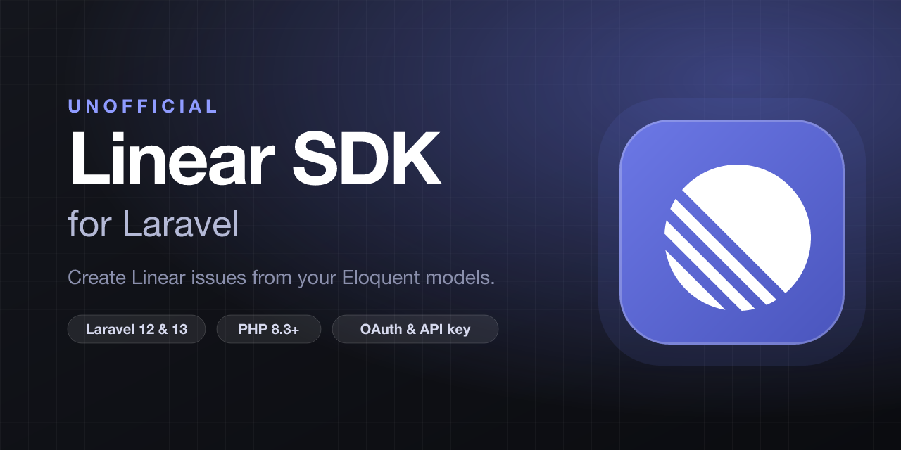

<p align="center"></p>

# Linear SDK for Laravel

> [!NOTE]
> **This is an unofficial, community-built package. It is not affiliated with, endorsed by, or sponsored by Linear.** "Linear" and the Linear logo are trademarks of Linear. This package simply talks to Linear's public API.

[](https://packagist.org/packages/dniccum/linear-sdk)
[](https://github.com/dniccum/linear-sdk/actions/workflows/run-tests.yml)
[](https://github.com/dniccum/linear-sdk/actions/workflows/fix-php-code-style-issues.yml)
[](https://packagist.org/packages/dniccum/linear-sdk)

Create [Linear](https://linear.app) issues from your Eloquent models, the way Laravel Spark handles billing: add a trait to a model, let your users connect their Linear workspace on a ready-made configuration page, and issues are created for you from the model's lifecycle events.

- **Model traits** that add Linear attributes (`linear_issue_url`, `linear_issue_identifier`, `linear_sync_status`) and tie issue creation to `created`, `updated` and `deleted`.
- **Optional configuration page** with your own branding: connect (OAuth 2.0 with PKCE, or a personal API key), pick the team, project, status, labels, priority and assignee, and choose automatic or manual sending. Don't want it? Turn it off and build your own UI on the headless [Actions](#building-your-own-ui).
- **Safe by design**: issues and comments are created from queued jobs with retries, are idempotent (a retry never creates a duplicate), and a failure never breaks the save of your own model.
- **Fully typed** (PHPStan level 9, strict TypeScript) and tested to 100% coverage.

## Requirements

- PHP 8.3 or 8.4
- Laravel 12 or 13
- A Linear workspace, plus either a [Linear OAuth application](https://linear.app/settings/api/applications) or personal API keys

## Installation

```bash
composer require dniccum/linear-sdk
```

Publish and run the migrations, then (optionally) the config file and the page's compiled assets:

```bash
php artisan vendor:publish --tag=linear-migrations
php artisan migrate

php artisan vendor:publish --tag=linear-config
php artisan vendor:publish --tag=linear-assets   # required for the configuration page
```

| Tag | Publishes |
|---|---|
| `linear-config` | `config/linear.php` |
| `linear-migrations` | the four tables (set `table_prefix` / `key_type` in the config **before** migrating) |
| `linear-views` | the Blade views, so you can restyle the page |
| `linear-assets` | the compiled JS/CSS to `public/vendor/linear` |

### Keep the front-end assets up to date

The configuration page's JavaScript and CSS are published into your `public` directory, so a copy from an older release stays there until you publish again. The page reads its asset manifest from the installed package but serves the files from `public/vendor/linear`, so after an upgrade with stale published files the page would link to bundles that no longer exist and fail to load. Re-publish them every time Composer updates the package by adding the command to the `post-update-cmd` scripts in your application's `composer.json`:

```json
"scripts": {
    "post-update-cmd": [
        "@php artisan vendor:publish --tag=laravel-assets --ansi --force",
        "@php artisan vendor:publish --tag=linear-assets --ansi --force"
    ]
}
```

(`laravel-assets` is already there in a default Laravel application; add the `linear-assets` line beneath it.) The `--force` flag overwrites the previously published files, and the compiled files use hashed names, so browsers pick up the new version straight away. If you deploy with `composer install`, run the same command as a deploy step, or add it to `post-install-cmd` too.

If you do not use the built-in page (the `ui` route group is off, or you build your own UI), you can skip this.

Make sure a queue worker is running; issues and comments are sent from queued jobs.

## Configuration

```env
LINEAR_AUTH_MODE=oauth            # or api_key
LINEAR_CLIENT_ID=...
LINEAR_CLIENT_SECRET=...
# LINEAR_REDIRECT_URI=            # defaults to route('linear.callback')
```

For OAuth, create an application at **Linear → Settings → API → OAuth applications** and register `https://your-app.test/linear/callback` as its callback URL. The requested scopes are `read`, `issues:create` and `comments:create`; the grant is refused if Linear returns fewer.

In `api_key` mode each owner pastes a personal API key (Linear → Settings → API). It is validated against Linear when saved, stored encrypted, and never expires.

Every option is documented in [`config/linear.php`](config/linear.php).

## Quick start

### 1. Mark the owner

The owner is whoever connects a Linear workspace: usually a `User` or a `Team`.

```php
use Dniccum\Linear\Concerns\HasLinearConnection;

class User extends Authenticatable
{
    use HasLinearConnection;
}
```

```php
$user->hasLinearConnection();   // bool
$user->linearConnection;        // LinearConnection|null
$user->linearDestination;       // LinearDestination|null (team, project, state, labels, ...)
$user->linearClient();          // talk to Linear as this owner
$user->disconnectLinear();
```

### 2. Mark the models that become issues

```php
use Dniccum\Linear\Concerns\CreatesLinearIssues;

class SupportRequest extends Model
{
    use CreatesLinearIssues;

    protected $appends = ['linear_issue_url', 'linear_issue_identifier', 'linear_sync_status'];

    public function user(): BelongsTo { /* ... */ }
}
```

That's it. When a `SupportRequest` is created and its owner has an active connection with a destination in **automatic** mode, an issue is filed in Linear. The model gains:

```php
$request->linear_issue_url;         // "https://linear.app/acme/issue/SUP-42/..."
$request->linear_issue_identifier;  // "SUP-42"
$request->linear_sync_status;       // LinearSyncStatus::Pending|Synced|Failed|null
$request->linearIssueLink;          // the underlying LinearIssueLink
```

### 3. Send manually, retry, comment

```php
$request->sendToLinear();                          // file it now (manual mode)
$request->sendToLinear(['title' => 'Custom title']);
$request->retryLinear();                           // retry a failed sync
$request->commentOnLinear('Customer replied.');    // comment on its issue
```

### 4. Open the page

Visit `/linear` while signed in. Done.

## Tying issues to model lifecycle events

Override `linearEvents()` to choose which events act on Linear (default: `['created']`):

```php
public function linearEvents(): array
{
    return ['created', 'updated', 'deleted'];
}
```

| Event | Not yet linked | Already linked |
|---|---|---|
| `created` / `updated` | files the issue (when the owner is in automatic mode) | `updated`: posts a comment listing changes if `on_update` is `comment`; otherwise nothing |
| `deleted` | nothing | posts "was deleted" if `on_delete` is `comment`; otherwise nothing |

Set `on_update` / `on_delete` in `config/linear.php`.

### Customising the issue

Override any hook on your model (or implement `Dniccum\Linear\Contracts\ComposesLinearIssue` to take full control):

```php
public function linearOwner(): ?Model            // who owns the connection (default: $this->user)
public function linearTitle(): string            // issue title
public function linearDescription(): string      // issue description (Markdown)
public function linearComment(string $event, array $context = []): string
public function linearDestinationOverride(): ?LinearDestination  // use a different team/project for this model
```

### Events

Listen for what happened:

```php
use Dniccum\Linear\Events\{LinearIssueCreated, LinearIssueFailed, LinearCommentDelivered};

Event::listen(LinearIssueCreated::class, fn ($e) => logger($e->link->linear_issue_url));
```

## The configuration page

`GET /linear` renders a standalone, branded page: connection card, destination form (team, project, status, labels, priority, assignee, **automatic / manual**), and a list of recent failures with a retry button.

### Branding

```php
// config/linear.php
'brand' => [
    'name' => 'Acme Support',
    'logo' => '/images/logo.svg',   // URL or null
    'color' => '#0F766E',           // accent colour
],
```

Run `php artisan vendor:publish --tag=linear-views` to change the markup.

### Authorization and the owner

By default the signed-in user (`$request->user()`) is the owner and the routes use the `web` and `auth` middleware. Customise from a service provider:

```php
use Dniccum\Linear\Facades\Linear;

Linear::resolveOwnerUsing(fn (Request $request) => $request->user()->currentTeam);

Linear::authorizeUsing(fn (Request $request, Model $owner) => $request->user()->can('manage-integrations', $owner));
```

Change the URL or middleware with `path` and `middleware` in the config.

### Signed-out users

If a user's session expires while they are using the page (or they open it signed out), they are sent to your login page instead of seeing a raw error. The page's requests that come back `401` or `419` redirect the browser, and package routes reached without a signed-in user redirect there too. The destination defaults to your `login` route and is configurable:

```php
// config/linear.php (or LINEAR_LOGIN_ROUTE in .env)
'login_route' => 'login',          // a route name
// 'login_route' => '/sign-in',    // a path
// 'login_route' => 'https://sso.example.com/login',   // a full URL
// 'login_route' => null,          // disable: requests are refused with a 403 instead
```


### Embedding or disabling it

Embed the page inside your own layout, with the route group turned off:

```blade
<x-linear::settings />
<x-linear::assets />
```

```php
// config/linear.php
'routes' => ['ui' => false, 'oauth' => true, 'api' => true],
```

The three route groups (`ui`, `oauth`, `api`) are independent. To register no routes at all, call `Linear::ignoreRoutes()` from a service provider's `register()` method.

## Building your own UI

Everything the page does is available as headless, typed Actions, and as a documented HTTP contract ([docs/http-contract.md](docs/http-contract.md)).

```php
use Dniccum\Linear\Actions\{BuildConnectUrl, HandleOAuthCallback, SaveApiKey, DisconnectLinear,
    ListTeams, ListTeamOptions, SaveDestination, DeleteDestination, RetryFailedSync};

app(BuildConnectUrl::class)->execute($request->session());              // OAuth URL to redirect to
app(SaveApiKey::class)->execute($owner, $request->string('api_key'));
$teams   = app(ListTeams::class)->execute($owner);
$options = app(ListTeamOptions::class)->execute($owner, $teamId);
app(DisconnectLinear::class)->execute($owner);

$settings = Linear::settingsFor($owner);   // typed DTO for rendering your own page
```

Disable the package routes (`routes.* => false` or `Linear::ignoreRoutes()`) and wire the Actions into your own controllers, Inertia pages or Livewire components.

## Testing your application

`Linear::fake()` swaps Linear for an in-memory double, so no HTTP request is made:

```php
use Dniccum\Linear\Data\IssuePayload;
use Dniccum\Linear\Exceptions\LinearApiException;
use Dniccum\Linear\Facades\Linear;

it('files a Linear issue for a new support request', function () {
    $linear = Linear::fake();

    $request = SupportRequest::factory()->create();

    $linear->assertIssueCreated(fn (IssuePayload $payload) => $payload->title === $request->subject);
});

Linear::fake()->failWith('createIssue', new LinearApiException('Linear is down', LinearApiException::TRANSIENT), times: 2);
```

Available helpers: `withTeams()`, `withTeamOptions()`, `withViewer()`, `withTokens()`, `failWith()`, `assertIssueCreated()`, `assertIssueCreatedCount()`, `assertNoIssueCreated()`, `assertCommentPosted()`, `assertNoCommentPosted()`, `assertNothingSent()`.

## How it behaves

- **Idempotent.** Each issue and comment gets a client-generated UUID. If a request times out after Linear created the issue, the retry finds and adopts it instead of creating a duplicate.
- **Resilient.** Jobs retry 5 times with backoff (30s, 2m, 10m, 30m). Rate limits and outages retry; permanent rejections fail fast and show up on the configuration page with a retry button.
- **Safe.** Lifecycle hooks swallow and `report()` their errors, so Linear can never lose or break a save of your own model.
- **Self-healing auth.** OAuth tokens refresh under a cache lock; connections whose authorization is revoked are marked *needs reconnect* and shown that way in the UI.

## Frontend development

The page is TypeScript + Alpine compiled with Vite. The compiled assets are committed, so using the package never requires Node. To work on the page itself, see [docs/frontend.md](docs/frontend.md):

```bash
npm ci
LINEAR_WORKBENCH_FAKE=true LINEAR_AUTH_MODE=api_key composer serve   # demo app, no real Linear needed
LINEAR_VITE_DEV_URL=http://localhost:5173 npm run dev                # HMR
npm run build                                                        # rebuild and commit public/build
```

## Testing the package

```bash
composer check          # pint, phpstan (level 9), pest with 100% coverage
npm run typecheck && npm run lint && npm run test:coverage
```

CI runs the PHP suite on PHP 8.3/8.4 × Laravel 12/13 × lowest/stable on Linux and Windows, plus PHPStan, Pint and the frontend checks.

## Changelog

See [CHANGELOG](CHANGELOG.md).

## Contributing

See [CONTRIBUTING](CONTRIBUTING.md).

## Credits

- [Doug Niccum](https://github.com/dniccum)
- Inspired by the billing experience of [Laravel Spark](https://spark.laravel.com).

## License

The MIT License (MIT). See [LICENSE](LICENSE.md).
